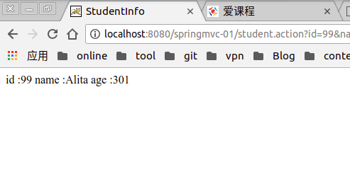

### Src:[springmvc-01](../.local/static/2019/5/0/springmvc-01.1559480190887.zip)
### Result :
 
#### 　false : 


#### success : 




### （1）创建WEB Project，项目名称为：SPringmvc-01。


### （2）加载JAR包：
```java
commons-logging-1.1.1.jar         spring-core-4.2.4.RELEASE.jar
jstl-1.2.jar                      spring-expression-4.2.4.RELEASE.jar
spring-aop-4.2.4.RELEASE.jar      spring-web-4.2.4.RELEASE.jar
spring-beans-4.2.4.RELEASE.jar    spring-webmvc-4.2.4.RELEASE.jar
spring-context-4.2.4.RELEASE.jar

```


并将JAR包配置到类路径。


### （3）在com.sdut.pojo包里创建Student，代码如下：
```java
package com.sdut.pojo;

public class Student {

	private Integer id;
	private String name;
	private Integer age;

	public void setId(Integer id) {
		this.id = id;
	}

	public void setAge(Integer age) {
		this.age = age;
	}

	public String getName() {
		return name;
	}

	public void setName(String name) {
		this.name = name;
	}

	public Student() {
		super();
		// TODO Auto-generated constructor stub
	}

	public Integer getId() {
		return id;
	}

	public Integer getAge() {
		return age;
	}

	public Student(Integer id, String name, Integer age) {
		super();
		this.id = id;
		this.name = name;
		this.age = age;
	}

	@Override
	public String toString() {
		return "Student [id=" + id + ", name=" + name + ", age=" + age + "]";
	}

	@Override
	public int hashCode() {
		final int prime = 31;
		int result = 1;
		result = prime * result + ((age == null) ? 0 : age.hashCode());
		result = prime * result + ((id == null) ? 0 : id.hashCode());
		result = prime * result + ((name == null) ? 0 : name.hashCode());
		return result;
	}

	@Override
	public boolean equals(Object obj) {
		if (this == obj)
			return true;
		if (obj == null)
			return false;
		if (getClass() != obj.getClass())
			return false;
		Student other = (Student) obj;
		if (age == null) {
			if (other.age != null)
				return false;
		} else if (!age.equals(other.age))
			return false;
		if (id == null) {
			if (other.id != null)
				return false;
		} else if (!id.equals(other.id))
			return false;
		if (name == null) {
			if (other.name != null)
				return false;
		} else if (!name.equals(other.name))
			return false;
		return true;
	}


}

```

### （4）com.sdut.controller 下创建　StudentController 

```java
package com.sdut.controller;

import org.springframework.stereotype.Controller;
import org.springframework.ui.Model;
import org.springframework.web.bind.annotation.RequestMapping;

import com.sdut.pojo.Student;

@Controller
public class StudentController {

	@RequestMapping("student")
	public String student(Student stu, Model model) {
		System.out.println(stu);

		if (stu.getAge() != null || stu.getId() != null || stu.getName() != null && stu.getName() != "") {
			model.addAttribute("stu", stu);
			return "studentInfo";

		} else {
			// 模拟查询商品列表
			return "success";

		}
	}
}

```

### （5）。。。。。。。

（7）在。。。创建XML文件，文件名为：***.xml，在其中填充代码后，文件内容为：

（8）在。。。包中创建Controller类，代码为：

（8）在。。。创建JSP页面****.jsp，代码为：

（9）在浏览器地址栏输入。。。。。。，执行效果为：（截图）。。。。。

（10）整个项目压缩文件为：

（项目文件夹压缩为一个ZIP文件，或者RAR文件，作为附件上传）。