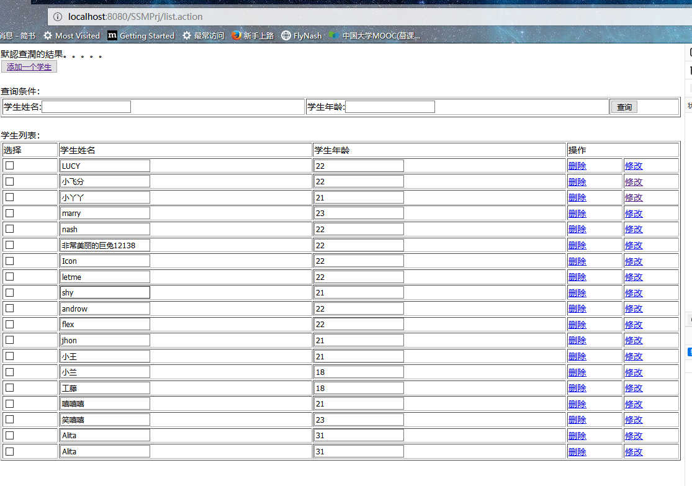
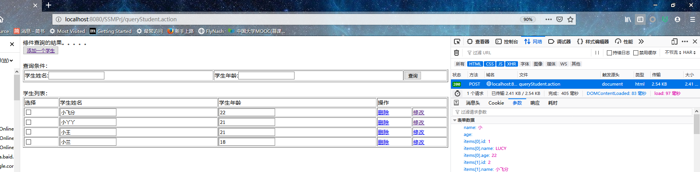
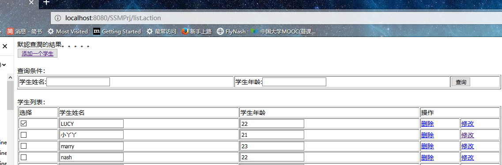
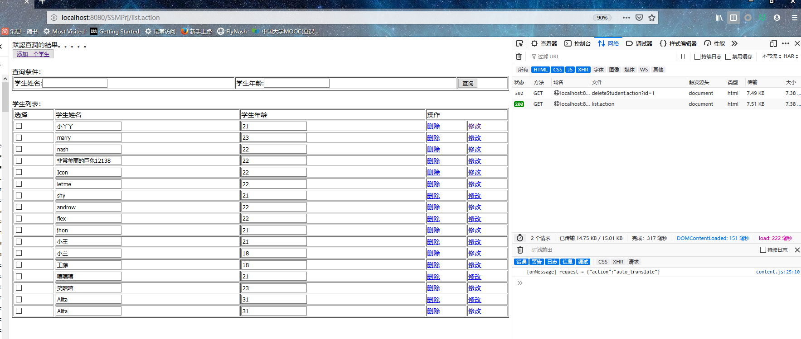
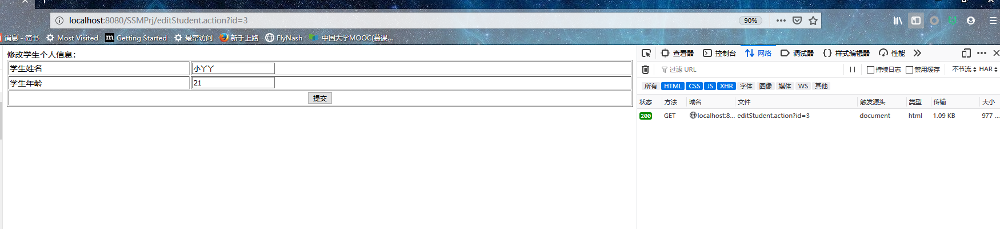
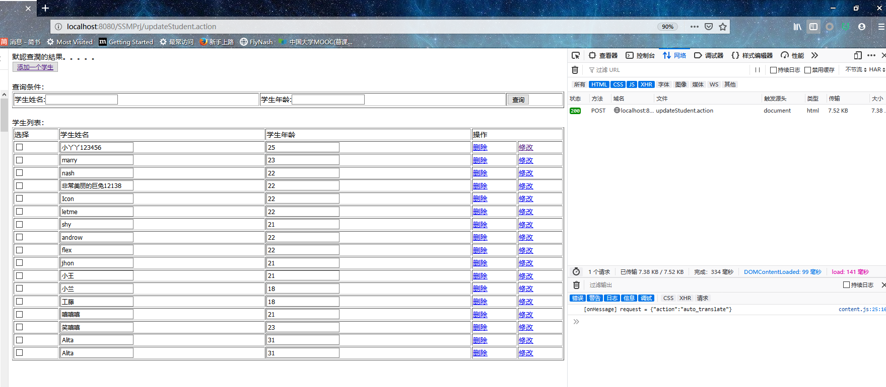
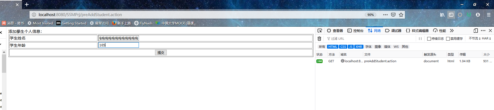
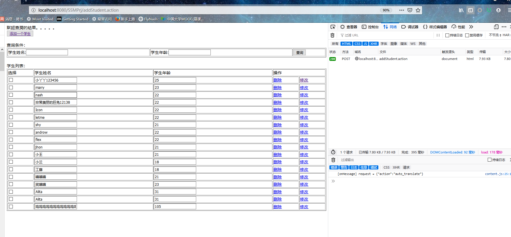

### 推荐查看方式：
- [传送门](https://github.com/WhyWhatHow/Software/blob/master/JavaEE/lab6.md)
### finished:
- 对学生表的增删改查(必做四个完成）
- 对学生表的模糊查询，（动态 sql）（选做3完成）

### question: 
- 关于 request scope 的问题，以及 请求参数是如何与对应的类文件形成的映射

### result：
- 默认查询： 
 



- 模糊查询:
- 
- 删除用户信息前：
- 
- 删除用户信息后：
-  
- 更新用户信息前： 
- 
- 更新用户信息后： 
- 
- 插入用户信息前： 
- 
- 插入用户信息后： 
- 

### Step：
  
#### 1）创建WEB Project，项目名称为：SSMPrj。

#### 2）加载JAR包：
```java
aopalliance-1.0.jar            mybatis-3.2.7.jar
asm-3.3.1.jar                  mybatis-spring-1.2.2.jar
aspectjweaver-1.6.11.jar       mysql-connector-java-5.1.7-bin.jar
cglib-2.2.2.jar                slf4j-api-1.7.5.jar
commons-dbcp-1.2.2.jar         slf4j-log4j12-1.7.5.jar
commons-fileupload-1.2.2.jar   spring-aop-4.2.4.RELEASE.jar
commons-io-2.4.jar             spring-aspects-4.2.4.RELEASE.jar
commons-logging-1.1.1.jar      spring-beans-4.2.4.RELEASE.jar
commons-pool-1.3.jar           spring-context-4.2.4.RELEASE.jar
jackson-annotations-2.4.0.jar  spring-context-support-4.2.4.RELEASE.jar
jackson-core-2.4.2.jar         spring-core-4.2.4.RELEASE.jar
jackson-databind-2.4.2.jar     spring-expression-4.2.4.RELEASE.jar
javassist-3.17.1-GA.jar        spring-jdbc-4.2.4.RELEASE.jar
jstl-1.2.jar                   spring-jms-4.2.4.RELEASE.jar
junit-4.9.jar                  spring-messaging-4.2.4.RELEASE.jar
log4j-1.2.17.jar               spring-tx-4.2.4.RELEASE.jar
log4j-api-2.0-rc1.jar          spring-web-4.2.4.RELEASE.jar
log4j-core-2.0-rc1.jar         spring-webmvc-4.2.4.RELEASE.jar

```
并将JAR包配置到类路径。

####（3) spring ，springmvc， mybatis  配置（config下） ：
##### spring :
- applicationContext-dao.xml
```xml
<?xml version="1.0" encoding="UTF-8"?>
<beans xmlns="http://www.springframework.org/schema/beans"
	xmlns:context="http://www.springframework.org/schema/context"
	xmlns:p="http://www.springframework.org/schema/p"
	xmlns:aop="http://www.springframework.org/schema/aop"
	xmlns:tx="http://www.springframework.org/schema/tx"
	xmlns:xsi="http://www.w3.org/2001/XMLSchema-instance"
	xsi:schemaLocation="
	http://www.springframework.org/schema/beans
	http://www.springframework.org/schema/beans/spring-beans-4.0.xsd
	http://www.springframework.org/schema/context
	http://www.springframework.org/schema/context/spring-context-4.0.xsd
	http://www.springframework.org/schema/aop 
	http://www.springframework.org/schema/aop/spring-aop-4.0.xsd 
	http://www.springframework.org/schema/tx 
	http://www.springframework.org/schema/tx/spring-tx-4.0.xsd
	http://www.springframework.org/schema/util 
	http://www.springframework.org/schema/util/spring-util-4.0.xsd">

	<!-- 加载配置文件 -->
	<context:property-placeholder
		location="classpath:jdbc.properties" />

	<!-- 数据库连接池 -->
	<bean id="dataSource"
		class="org.apache.commons.dbcp.BasicDataSource" destroy-method="close">
		<property name="driverClassName" value="${jdbc.driver}" />
		<property name="url" value="${jdbc.url}" />
		<property name="username" value="${jdbc.username}" />
		<property name="password" value="${jdbc.password}" />
		<!-- 连接池的最大数据库连接数 -->
		<property name="maxActive" value="10" />
		<!-- 最大空闲数 -->
		
		<property name="maxIdle" value="5" />
	</bean>

	<!-- SqlSessionFactory配置 -->
	<bean id="sqlSessionFactory"
		class="org.mybatis.spring.SqlSessionFactoryBean">
		<property name="dataSource" ref="dataSource" />
		<!-- 加载mybatis核心配置文件 -->
		<property name="configLocation"
			value="classpath:mybatis-config.xml" />
		<!-- 别名包扫描 -->
		<property name="typeAliasesPackage"
			value="com.sdut.ssm.pojo" />
	</bean>

	<!-- 动态代理，第二种方式：包扫描（推荐）： -->
	<bean class="org.mybatis.spring.mapper.MapperScannerConfigurer">
		<!-- basePackage多个包用","分隔 -->
		<property name="basePackage"
			value="com.sdut.ssm.mapper" />
	</bean>
</beans>

```
- applicationContext-service.xml
```xml
<?xml version="1.0" encoding="UTF-8"?>
<beans xmlns="http://www.springframework.org/schema/beans"
	xmlns:context="http://www.springframework.org/schema/context" xmlns:p="http://www.springframework.org/schema/p"
	xmlns:aop="http://www.springframework.org/schema/aop" xmlns:tx="http://www.springframework.org/schema/tx"
	xmlns:xsi="http://www.w3.org/2001/XMLSchema-instance"
	xsi:schemaLocation="http://www.springframework.org/schema/beans
	 http://www.springframework.org/schema/beans/spring-beans-4.0.xsd
	http://www.springframework.org/schema/context
	 http://www.springframework.org/schema/context/spring-context-4.0.xsd
	http://www.springframework.org/schema/aop
	 http://www.springframework.org/schema/aop/spring-aop-4.0.xsd 
	 http://www.springframework.org/schema/tx 
	 http://www.springframework.org/schema/tx/spring-tx-4.0.xsd
	http://www.springframework.org/schema/util 
	http://www.springframework.org/schema/util/spring-util-4.0.xsd">
	<!-- @Service包扫描器 -->
	<context:component-scan base-package="com.sdut.ssm.service"/>
</beans>

```
- applicationContext-trans.xml
```
<?xml version="1.0" encoding="UTF-8"?>
<beans xmlns="http://www.springframework.org/schema/beans"
	xmlns:context="http://www.springframework.org/schema/context" xmlns:p="http://www.springframework.org/schema/p"
	xmlns:aop="http://www.springframework.org/schema/aop" xmlns:tx="http://www.springframework.org/schema/tx"
	xmlns:xsi="http://www.w3.org/2001/XMLSchema-instance"
	xsi:schemaLocation="http://www.springframework.org/schema/beans
	 http://www.springframework.org/schema/beans/spring-beans-4.0.xsd
	http://www.springframework.org/schema/context
	 http://www.springframework.org/schema/context/spring-context-4.0.xsd
	http://www.springframework.org/schema/aop
	 http://www.springframework.org/schema/aop/spring-aop-4.0.xsd
	  http://www.springframework.org/schema/tx
	   http://www.springframework.org/schema/tx/spring-tx-4.0.xsd
	http://www.springframework.org/schema/util 
	http://www.springframework.org/schema/util/spring-util-4.0.xsd">

	<!-- 事务管理器 -->
	<bean id="transactionManager"
		class="org.springframework.jdbc.datasource.DataSourceTransactionManager">
		<!-- 数据源 -->
		<property name="dataSource" ref="dataSource" />
	</bean>

	<!-- 通知 -->
	<tx:advice id="txAdvice" transaction-manager="transactionManager">
		<tx:attributes>
			<!-- 传播行为 -->
			<tx:method name="save*" propagation="REQUIRED" />
			<tx:method name="insert*" propagation="REQUIRED" />
			<tx:method name="delete*" propagation="REQUIRED" />
			<tx:method name="update*" propagation="REQUIRED" />
			<tx:method name="find*" propagation="SUPPORTS" read-only="true" />
			<tx:method name="get*" propagation="SUPPORTS" read-only="true" />
			<tx:method name="query*" propagation="SUPPORTS" read-only="true" />
		</tx:attributes>
	</tx:advice>

	<!-- 切面 -->
	<aop:config>
		<aop:advisor advice-ref="txAdvice"
			pointcut="execution(* com.sdut.ssm.service.*.*(..))" />
	</aop:config>

</beans>

```

##### springmvc 配置： springmvc.xml
```xml
<?xml version="1.0" encoding="UTF-8"?>
<beans xmlns="http://www.springframework.org/schema/beans"
	xmlns:xsi="http://www.w3.org/2001/XMLSchema-instance" xmlns:p="http://www.springframework.org/schema/p"
	xmlns:context="http://www.springframework.org/schema/context"
	xmlns:mvc="http://www.springframework.org/schema/mvc"
	xsi:schemaLocation="
		http://www.springframework.org/schema/beans
	 	http://www.springframework.org/schema/beans/spring-beans-4.0.xsd
        http://www.springframework.org/schema/mvc 
        http://www.springframework.org/schema/mvc/spring-mvc-4.0.xsd
        http://www.springframework.org/schema/context 
        http://www.springframework.org/schema/context/spring-context-4.0.xsd">

	<!-- 配置@controller扫描包 -->
	<context:component-scan base-package="com.sdut.ssm.controller" />
	
	
	<!-- 配置注解驱动，相当于同时使用最新处理器映射跟处理器适配器,对json数据响应提供支持 -->
	<mvc:annotation-driven />
	<!-- 使用自定义转换器 -->
<!-- 	<mvc:annotation-driven conversion-service="MyConvert" /> -->
	
	<!-- 定义转换器 -->
<!-- 	<bean id="MyConvert" class="org.springframework.format.support.FormattingConversionServiceFactoryBean"> -->
<!-- 		<property name="converters"> -->
<!-- 			<set> -->
<!-- 				<bean class="com.itheima.springmvc.utils.DateConvert" /> -->
<!-- 			</set> -->
<!-- 		</property> -->
<!-- 	</bean> -->
	
	<!-- 配置视图解析器 -->
	<bean class="org.springframework.web.servlet.view.InternalResourceViewResolver">
		<property name="prefix" value="/WEB-INF/jsp/"/>
		<property name="suffix" value=".jsp"/>
	</bean>
	
	<!-- 配置全局异常处理器 -->
<!-- 	<bean class="com.itheima.springmvc.exception.CustomerExceptionResolver"/> -->
	
	<!-- 配置多媒体处理器 -->
	<!-- 注意：这里id必须填写：multipartResolver -->
<!-- 	<bean id="multipartResolver" class="org.springframework.web.multipart.commons.CommonsMultipartResolver"> -->
		<!-- 最大上传文件大小 -->
<!-- 		<property name="maxUploadSize" value="8388608" /> -->
<!-- 	</bean> -->
	
<!-- 	<mvc:interceptors> -->
<!-- 		<mvc:interceptor> -->
			<!-- /**拦截所有请求，包括二级以上目录 -->
<!-- 			<mvc:mapping path="/**"/> -->
<!-- 			<bean class="com.itheima.springmvc.interceptor.MyInterceptor" /> -->
<!-- 		</mvc:interceptor> -->
<!-- 		<mvc:interceptor> -->
			<!-- /**拦截所有请求，包括二级以上目录 -->
<!-- 			<mvc:mapping path="/**"/> -->
<!-- 			<bean class="com.itheima.springmvc.interceptor.MyInterceptor2" /> -->
<!-- 		</mvc:interceptor> -->
<!-- 		<mvc:interceptor> -->
			<!-- /**拦截所有请求，包括二级以上目录 -->
<!-- 			<mvc:mapping path="/**"/> -->
			<!-- 配置不拦截目录 -->
<!-- 			<mvc:exclude-mapping path="/user/**"/> -->
<!-- 			<bean class="com.itheima.springmvc.interceptor.LoginInterceptor" /> -->
<!-- 		</mvc:interceptor> -->
<!-- 	</mvc:interceptors> -->
	
</beans>

```
 
##### mybatis 配置： mybatis-config.xml
``xml
<?xml version="1.0" encoding="UTF-8" ?>
<!DOCTYPE configuration
PUBLIC "-//mybatis.org//DTD Config 3.0//EN"
"http://mybatis.org/dtd/mybatis-3-config.dtd">
<configuration>
</configuration>
``

####（4）在WebContent下创建 jsp文件 如下：
- studentList.jsp
```jsp
<%@ page language="java" contentType="text/html; charset=UTF-8"
    pageEncoding="UTF-8"%>
<%@ taglib uri="http://java.sun.com/jsp/jstl/core" prefix="c" %>
<%@ taglib uri="http://java.sun.com/jsp/jstl/fmt"  prefix="fmt"%>
<!DOCTYPE html PUBLIC "-//W3C//DTD HTML 4.01 Transitional//EN" "http://www.w3.org/TR/html4/loose.dtd">
<html>
<head>
<meta http-equiv="Content-Type" content="text/html; charset=UTF-8">
<title>查询学生信息 </title>
</head>
<body> 
<span>${ msg }</span>
<br>	
	<button><a href="${pageContext.request.contextPath }/preAddStudent.action">添加一个学生</a></button>
<br>
<br>
<form action="${pageContext.request.contextPath }/queryStudent.action" method="post">
查询条件：
<table width="100%" border=1>
<tr>
<td>学生姓名:<input type="text" name="name" ></td>
<td>学生年龄:<input type="text" name="age"  ></td>
<td><input type="submit" value="查询"/></td>
</tr>
<tr>
</tr>
</table>
<br>

学生列表：
<table width="100%" border=1>
<tr>
	<td>选择</td>
	<td>学生姓名</td>
	<td>学生年龄</td>
	<td colspan="2">操作</td>
</tr>
<c:forEach items="${list }" var="stu" varStatus="status">
<tr>
	<td><input type="checkbox" name="ids" value="${stu.id}"></td>
	<td>
	<input type="hidden" name="items[${ status.index }].id" value="${stu.id}">
	<input type="text" name="items[${ status.index }].name" value="${stu.name }"></td>
	<td><input type="text" name="items[${ status.index }].age" value="${stu.age }"></td>
	<td><a href="${pageContext.request.contextPath }/deleteStudent.action?id=${stu.id}">删除</a></td>
	<td><a href="${pageContext.request.contextPath }/editStudent.action?id=${stu.id}">修改</a></td>
</tr>
</c:forEach>

</table>
</form>
</body>

</html>
```
- studentEdit.jsp

```jsp
<%@ page language="java" contentType="text/html; charset=UTF-8"
    pageEncoding="UTF-8"%>
<%@ taglib uri="http://java.sun.com/jsp/jstl/core" prefix="c" %>
<%@ taglib uri="http://java.sun.com/jsp/jstl/fmt"  prefix="fmt"%>
<!DOCTYPE html PUBLIC "-//W3C//DTD HTML 4.01 Transitional//EN" "http://www.w3.org/TR/html4/loose.dtd">
<html>
<head>
<meta http-equiv="Content-Type" content="text/html; charset=UTF-8">
<title>修改信息</title>

</head>
<body> 
<span>${ msg }</span>
	<!-- 上传图片是需要指定属性 enctype="multipart/form-data" -->
	<!-- <form id="stuForm" action="" method="post" enctype="multipart/form-data"> -->
	<form id="student"	action="${pageContext.request.contextPath }/updateStudent.action" 
	method="post">
		<input type="hidden" name="id" value="${stu.id }" /> 修改学生个人信息：
		<table width="100%" border=1>
			<tr>
				<td>学生姓名</td>
				<td><input type="text" name="name" value="${stu.name }" /></td>
			</tr>
			<tr>
				<td>学生年龄</td>
				<td><input type="text" name="age" value="${stu.age }" /></td>
			</tr>
			
			
			<tr>
				<td colspan="2" align="center"><input type="submit" value="提交" />
				</td>
			</tr>
		</table>

	</form>
</body>

</html>
```
- addStudent.jsp
```jsp 
<%@ page language="java" contentType="text/html; charset=UTF-8"
    pageEncoding="UTF-8"%>
<%@ taglib uri="http://java.sun.com/jsp/jstl/core" prefix="c" %>
<%@ taglib uri="http://java.sun.com/jsp/jstl/fmt"  prefix="fmt"%>
<!DOCTYPE html PUBLIC "-//W3C//DTD HTML 4.01 Transitional//EN" "http://www.w3.org/TR/html4/loose.dtd">
<html>
<head>
<meta http-equiv="Content-Type" content="text/html; charset=UTF-8">
<title>添加學生</title>

</head>
<body> 
	<!-- 上传图片是需要指定属性 enctype="multipart/form-data" -->
	<!-- <form id="stuForm" action="" method="post" enctype="multipart/form-data"> -->
	<form id="student"	action="${pageContext.request.contextPath }/addStudent.action" 
	method="post">
		<input type="hidden" name="id" value="${stu.id }" /> 添加學生个人信息：
		<table width="100%" border=1>
			<tr>
				<td>学生姓名</td>
				<td><input type="text" name="name"  /></td>
			</tr>
			<tr>
				<td>学生年龄</td>
				<td><input type="text" name="age"  /></td>
			</tr>
			
			
			<tr>
				<td colspan="2" align="center"><input type="submit" value="提交" />
				</td>
			</tr>
		</table>

	</form>
</body>

</html>
```
（5）com.sdut.mapper 下创建dao接口：

（6）。。。。。。。

（7）在。。。创建XML文件，文件名为：***.xml，在其中填充代码后，文件内容为：

（8）在。。。包中创建Controller类，代码为：

（8）在。。。创建JSP页面****.jsp，代码为：