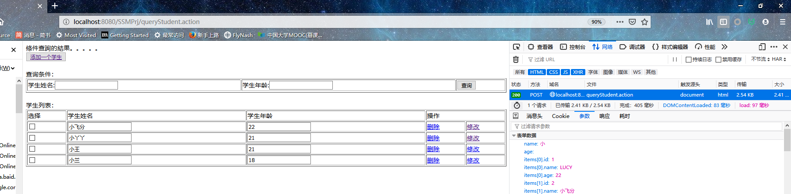

### finished:
- 对学生表的增删改查
- 对学生表的模糊查询，（动态 sql）

### question: 
- 关于 request scope 的问题，以及 请求参数是如何与对应的类文件形成的映射

### result：
- 默认查询： 

或者： 

- 模糊查询:
- 
- 删除用户信息前：
- 
- 删除用户信息后： 
- 更新用户信息前： 
- 更新用户信息后： 
- 插入用户信息前： 
- 插入用户信息后： 

### step：  

