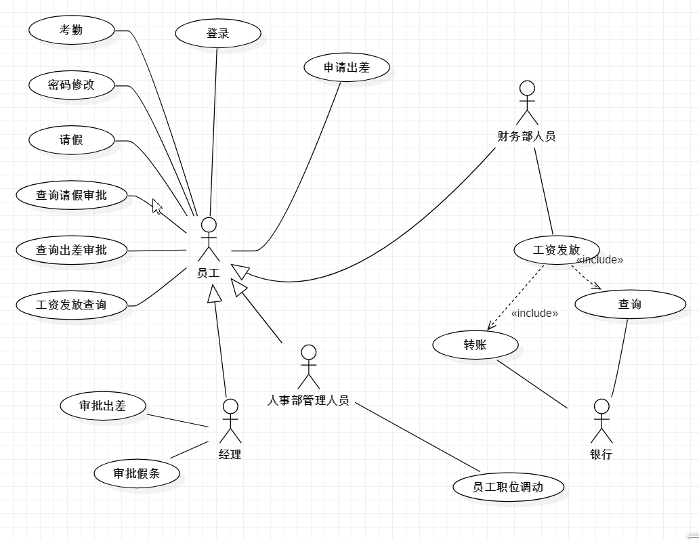

[传送门](https://github.com/WhyWhatHow/Software/blob/master/UML/UseCase%26%26Class.md)
### 需求分析：

- 员工：
> 可以进行登录，个人考勤，请假，申请出差，修改密码，查询出差审批，查询请假审批，查询工资发放
- 人事部管理人员：
> 除了可以有员工所有的功能外还可以进行职位调动
- 经理：
> 除了可以有员工所有的功能外还可以进行审批假条，审批出差
- 财务部人员：
> 除了可以有员工所有的功能外还可以进行工资发放
- 银行系统:
> 应该提供查询账户余额，转账的服务。

### 用例图：

### 类图：
-1559830850504.jpg?token=AH52T6RPBDSSQB35XT4BLQS47EQYI)